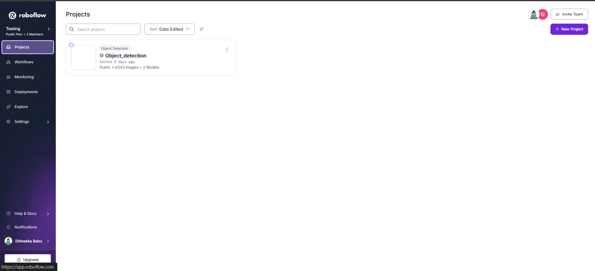
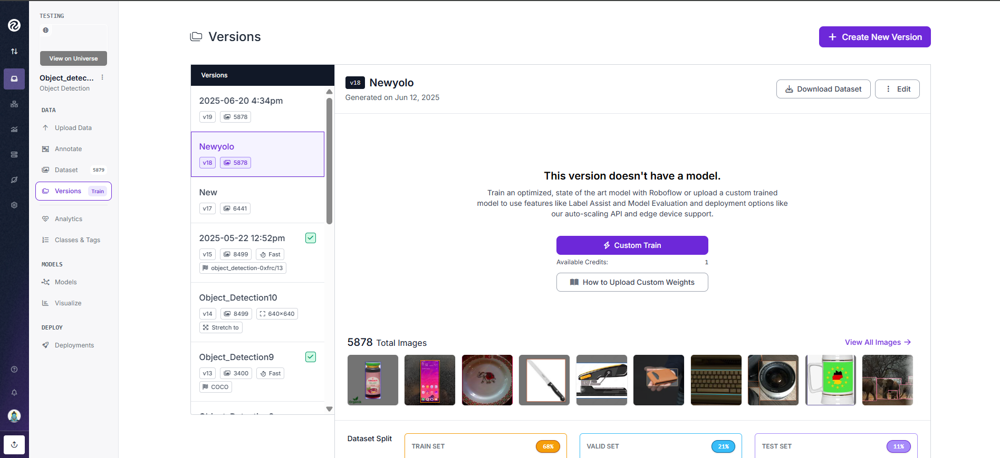
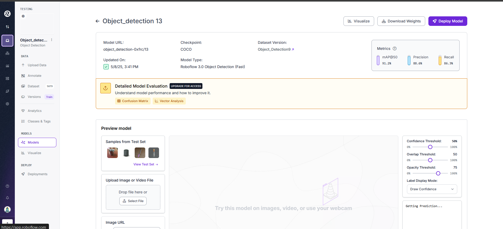

# Object Detection using YOLOv8

This repository contains the object detection work completed as part of my internship. It showcases training a YOLOv8 model on a **custom dataset** built with **Roboflow**, containing **non-COCO classes** and fine-tuned for high-accuracy detection.

---

##  Introduction to Object Detection

Object detection is a key computer vision task that involves identifying and localizing multiple objects within an image. It is used in a wide range of real-world applications like:

- Smart surveillance
- Autonomous vehicles
- Medical image analysis
- Industrial inspection
- Smart retail systems

Unlike image classification, object detection not only tells *what* is in an image, but also *where*.

---

##  Why YOLO (You Only Look Once)?

YOLO is a powerful real-time object detection algorithm known for its:

- ⚡️ Speed and efficiency — ideal for edge devices
- 🎯 High accuracy with fewer parameters
- 📦 Easy integration with custom datasets
- 🧠 Pretrained weights on COCO for faster convergence

For this project, I used **YOLOv8s**, the lightweight and fast variant, ideal for use on GPU-powered devices like Jetson.

---

##  My Project: Custom Object Detection Pipeline

###  About My Work

During the work, I:

- Created a custom dataset using **Roboflow**
- Collected **non-COCO classes** (not used in YOLO pretraining)
- Cloned and merged my dataset with the **Roboflow COCO subset**
- Combined and exported a **merged dataset** in YOLO format
- Trained a YOLOv8 model with augmentations and optimizations

###  Training Outcome

- Model Used: `yolov8s.pt` (pretrained)
- Dataset: ~5600+ images, 108+ classes (custom + COCO subset)
- Training Epochs: 100
- Accuracy: **Fluctuating between 85% to 90%**
- Final weights: `YoloTrainedModel/weights/best.pt`

---

##  Platform Used – Roboflow

For dataset creation and annotation, we used [**Roboflow**](https://app.roboflow.com/testing-f6dvv) My own dataset, a powerful web-based tool that streamlines the dataset management process for computer vision tasks.

---

###  Why Roboflow?

Roboflow is designed to simplify the end-to-end process of building high-quality datasets. It provides:

- 🏷️ **Efficient Annotation Tools** – Draw bounding boxes and assign labels easily.
- 🔄 **Version Control** – Keep track of dataset iterations and preprocessing changes.
- 🧪 **Augmentation & Preprocessing** – Apply rotations, flips, blurs, noise, and other transformations without coding.
- 💾 **Format Export** – Export your datasets in various popular formats including YOLO, COCO, VOC, TensorFlow, and more.
- 👥 **Collaboration** – Share projects with teammates securely.
- ☁️ **Hosted Datasets & APIs** – Access datasets via hosted URLs or integrate them directly into training pipelines.

---

###  How to Use Roboflow for Your Own Dataset

1. **Sign Up / Log In** at [https://roboflow.com](https://roboflow.com).
2. **Create a New Project**:
   - Choose the task type (e.g., Object Detection).
   - Name your project and upload your images.
3. **Annotate Your Images**:
   - Use the built-in annotation tool to label objects with bounding boxes.
4. **Generate a Dataset Version**:
   - Choose preprocessing options (resize, grayscale, augmentations, etc.).
   - Save the generated version for training.
5. **Export or Use via API**:
   - Download the dataset in the required format (YOLOv5, COCO, etc.).
   - Alternatively, use Roboflow’s API key and dataset link to integrate it into your training scripts.

### My Roboflow
<p align="center">
  
  
  
</p>


---

### ✅ Key Advantages

| Feature             | Benefit                                              |
|---------------------|------------------------------------------------------|
| No-code annotation  | Label images quickly without any setup               |
| Format flexibility  | Supports export to most major ML frameworks          |
| Augmentations       | Improve dataset diversity with minimal effort        |
| Cloud-based         | Access and manage your datasets from anywhere        |
| API integration     | Seamlessly pull datasets into training environments  |

---

### 🔗 Useful Resources

- 🌐 [Roboflow Homepage](https://roboflow.com)
- 📚 [Documentation](https://docs.roboflow.com)
- 🧠 [Blog & Tutorials](https://blog.roboflow.com)

---

##  Model Training – Google Colab

For model training, we used **Google Colab**, a cloud-based Jupyter notebook environment that provides free access to GPUs. You may also train the model on your **local machine**, provided it meets the necessary hardware and software requirements.

---

###  System Requirements (for Local Training)

If you choose to train the model on your local PC, ensure your system satisfies the following:

- ✅ A CUDA-capable GPU (e.g., NVIDIA GTX 1660 or higher recommended)
- ✅ At least **8–16 GB of RAM**
- ✅ **20+ GB free disk space** for dataset, weights, and checkpoints
- ✅ **Python 3.8+** and appropriate ML frameworks (e.g., PyTorch, Ultralytics YOLO)
- ✅ Installed dependencies (see `requirements.txt`)

---

###  Why Google Colab?

Google Colab offers several advantages that make it ideal for prototyping and training machine learning models:

- 💸 **Free GPU/TPU Access** (limited usage quotas)
- ☁️ **No Setup Required** – Fully pre-configured Jupyter environment
- 📦 **Easy Integration with Google Drive**
- 📊 **Real-time Output & Visualization** – View training logs, metrics, and loss graphs live
- 🧑‍💻 **Community-Friendly** – Share notebooks with others instantly

---

###  How to Use Google Colab for Training

1. **Open Colab**:
   - Visit [https://colab.research.google.com](https://colab.research.google.com)

2. **Set Runtime Environment**:
   - Click on `Runtime > Change runtime type`
   - Choose `GPU` as hardware accelerator

3. **Mount Google Drive** (to access your dataset or save model weights):
   ```python
   from google.colab import drive
   drive.mount('/content/drive')
   ```
   then continue with train script execution

---

## 🗂️ Folder Structure

<pre> ``` 
  General_Object_Detection/ │
  ├── Dataset/ 
  │ ├── data.yaml
  │ ├── README.dataset.txt
  │ ├── README.roboflow.txt
  │ ├── train/
  │ │ ├── images/
  │ │ │ └── *.jpg / *.png (training images)
  │ │ └── labels/
  │ │ └── *.txt (YOLO format annotations)
  │ └── valid/ │ ├── images/ │ │ └── *.jpg / *.png (validation images)
  │ └── labels/ │ └── *.txt (YOLO format annotations)
  │ ├── test/ │ │ ├── images/ │ │ │ └── *.jpg / *.png (training images)
  │ │ └── labels/ │ │ └── *.txt (YOLO format annotations)
  │ ├── TestImage/ │ └── *.jpg / *.png (test images for model evaluation)
  │ ├── YoloTrainedModel/
  │ └── weights/
  │ └── best.pt (trained YOLOv8 model weights)
  │ ├── train.py # Script to train YOLOv8 model
  ├── test.py # Script to test YOLOv8 model
  ├── requirements.txt # Python dependencies (Ultralytics, OpenCV, etc.)
  └── README.md # Complete documentation 
  ```</pre>

---

## 🛠️ How to Use This Project

---

### 1️⃣ Clone the repository

```bash

git clone https://github.com/DhinekkaB/Object-Detection-using-Yolo-for-custom-classes.git

cd Object-Detection-using-Yolo-for-custom-classes

```

---

### 📦 2. Create Virtual Environment (Python 3.11.9 recommended)

```bash

python -m venv new
# Activate the environment

# On macOS/Linux:
source new/bin/activate

# On Windows:
new\Scripts\activate

```

---

### 📥 3. Install Dependencies
```bash

pip install -r requirements.txt

```

---

### 🏋️‍♂️ 4. Train the Model (Optional – if going to train from the dataset instead of using trained weights provided)

## Update the train.py script:

```python
# Replace this:
data="/path to data.yaml"

# With this:
data="Dataset/data.yaml"
```
## Then run:

```bash

python train.py

```

---

### 📸 5. Run Inference on Test Images

## Edit test.py:

```python

model = YOLO("YoloTrainedModel/weights/best.pt") # Replace path correctly
image_path = "TestImage/Image.jpg" #Replace path correctly

```

## Then run:

```bash

python test.py

```
## The result will be saved in the inference_outputs/ directory and displayed via matplotlib.

---

### ✅ Requirements
# Main dependencies:

- ultralytics
- opencv-python
- matplotlib

## Install all with:

```bash

pip install -r requirements.txt

```

---

### 🙋 Author

- Dhinekka B
- GitHub: @[DhinekkaB](https://github.com/DhinekkaB)
- LinkedIn: [Dhinekka B](https://www.linkedin.com/in/dhinekka-b-344509290/)

---

### 📄 License

This project is for research and educational purposes. Licensing terms depend on YOLOv8 and Roboflow dataset usage.

---
